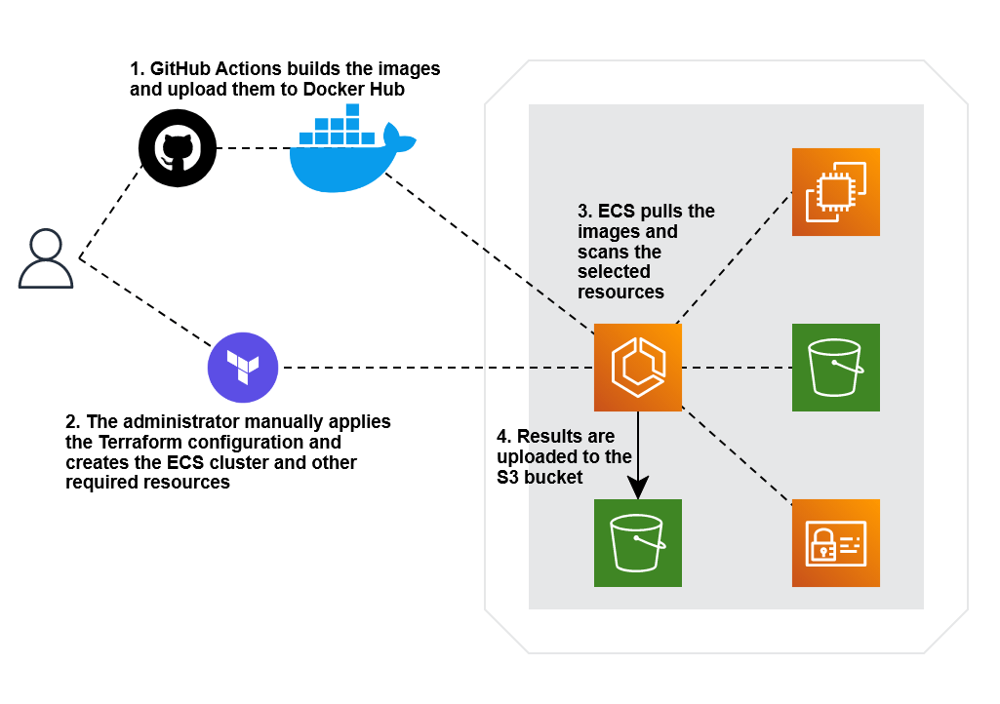

# AWS security assessment with Nmap, Prowler, and Pacu

Terraform configuration to deploy ECS cluster and run Nmap, Prowler and Pacu on AWS.
The output of these services can provide valuable insight on the current security posture for an AWS account, and the future hardening and remediations. 

### How these services work:

1. Nmap scans the networks looking for open ports.
2. Prowler scans the configuration of services and provides.
3. Pacu allows manual exploration and testing if needed.

Repo for the services: [cloudsec-scan-conts](https://github.com/jorgesoft/cloudsec-scan-conts)

### How this Terraform configuration works:

### Requirements:

1. A valid VPC ID
2. A public subnet to scan
4. An S3 bucket to save results
5. An administrator level account on AWS to deploy all resources

### Instructions:

1. Write the VPC ID, subnets to scan, S3 bucket and other options in the `variables.tf` file
2. Start Terraform with `terrafor init`
3. Deploy configuration with `terrafor apply`
4. Write a password to connect to the Pacu container
5. Wait for the results to appear in the selected S3 bucket

### Optional: Connect to Pacu container

1. Look for the logs for the Pacu container
2. SSH to the IP using `ssh root@[ip]`
3. Use the password used after running terraform apply

## TODO

1. ~~Remove hardcoding of S3 bucket~~
2. Create log group in Terraform and pass it to container definitions
3. ~~Remove unused security group~~
4. ~~Add GitHub actions container building~~